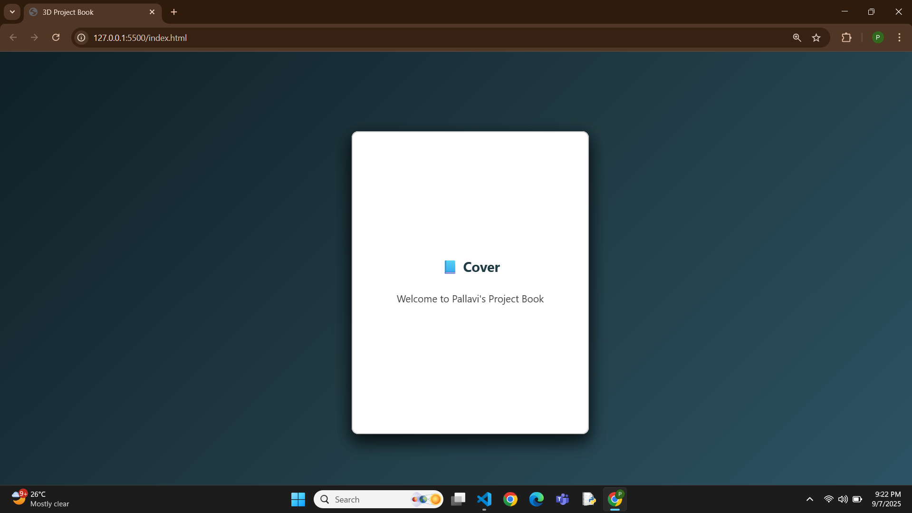

# 📘 3D Project Book
An **interactive 3D project showcase** built with HTML, CSS, and JavaScript.
Each page of the book highlights one of my GitHub projects.
Click on the pages to flip them like a real book 📖✨  

---

## 🚀 Demo
🎥 Watch the demo video: [Demo Video](demo.mp4)  
🖼️ Screenshot:  

  

---

## 🌟 Features
- Realistic **3D page flipping animation** using CSS.
- Interactive with **JavaScript** — click to flip forward and backward.
- Customizable content — replace with your own project names, descriptions, or images.
- Fully responsive and works in all modern browsers.

---

